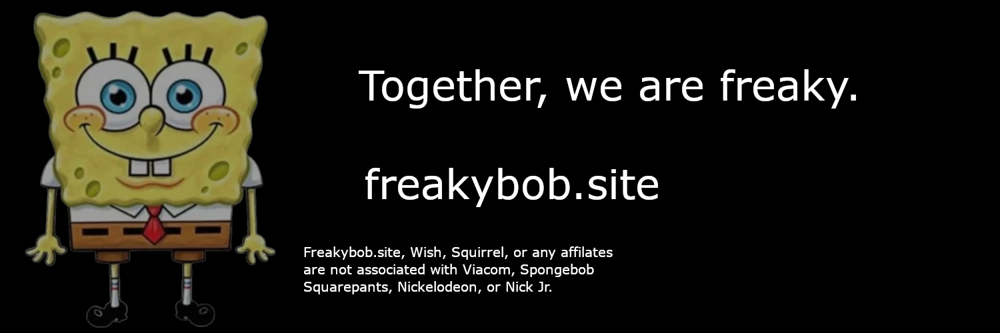

# freakybob
Prefer Codeberg or Disroot? We have that too. 
https://codeberg.org/Freakybob/Freakybob.site 
https://git.disroot.org/Freakybob/Freakybob.site

 

 
Freakybob.site is a website made by 5quirrel, wish13yt, #2 Twitter Hater and other contributors! 
Welcome to the offical Github of Freakybob.site where the website was first birthed!

⚠️THE WEBSITE IS STILL BEING UPDATED AS WE SPEAK!⚠️

To see credit for the icons we use, please go to https://github.com/Freakybob-Team/freaky-icons.

Some screenshots of the website :3

freakybob.site 2024. No rights reserved. Licensed under the GPL 3.0 license.

<a href="https://github.com/5quirre1"><button>5quirre1</button>

<a href="https://github.com/wish13yt"><button>wish13yt</button>

### Attributions
**Carefree** by Kevin MacLeod - CC BY 4.0